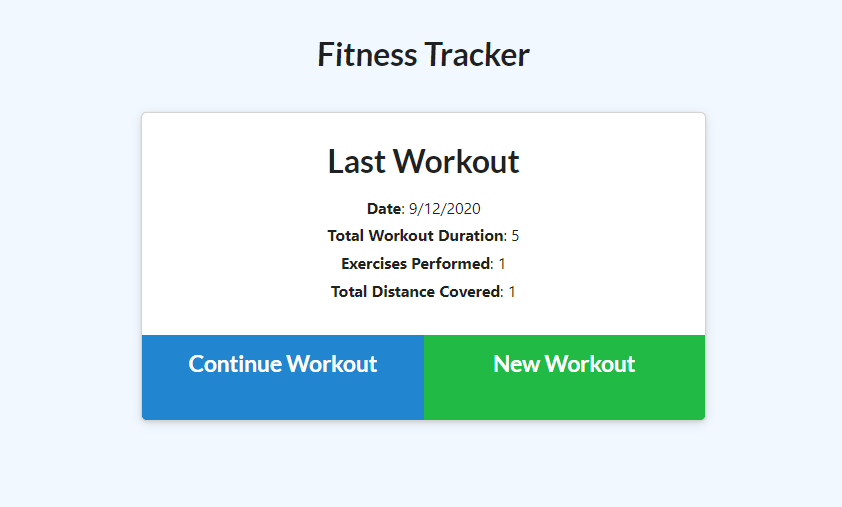
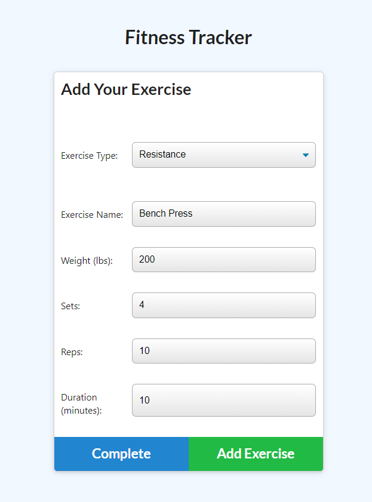
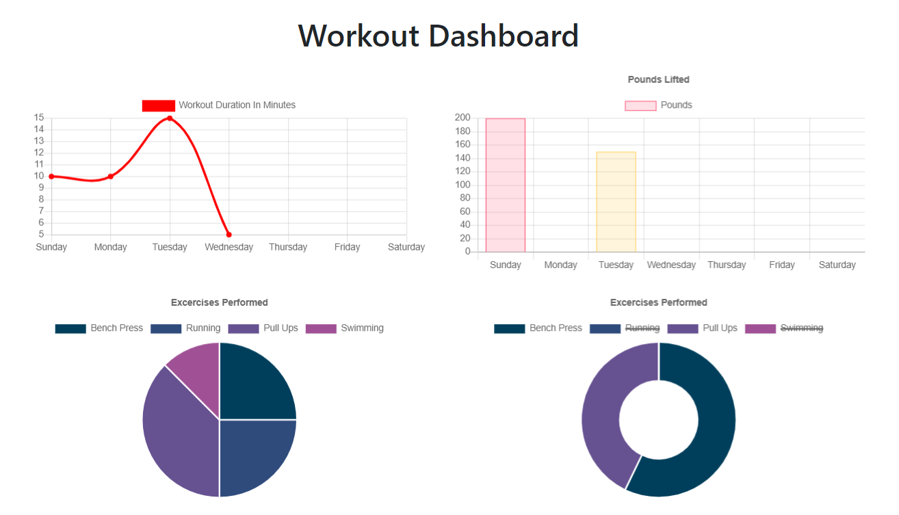

# Fitness Tracker
## Description

An application that allows users to view, create and track daily workouts. Users will be able to log multiple exercises in a workout on a given day. Depending on the type of exercises, users can track their performances for their workout!

[](https://opensource.org/licenses/MIT)


## Installation

```
npm install
```

## Usage

### Two Ways to access the application:
1. Click [here](https://agile-cliffs-57091.herokuapp.com/) to launch the application
2. Run "node server.js" or "npm start" in the terminal, then the port of the localhost server will appear. Be sure to navigate to the project folder before doing so

### Steps
1. On the first usage, there will be no workout displayed. Click on the "New Workout" button to begin!
2. Select the type of exercises (resistance or cardio)
3. Fill up the form of the selected type of exercise
4. Click "Add Exercise"
5. To add another exercise on the same day, select "Continue Workout" from the home page
6. To start a workout on a new day, select "New Workout" from the home page
7. Check your stats from the dashboard page!

### Screenshots




## License

License for this project: MIT

## Contributing

1. Fork/Clone this repo
2. Hack away!
3. Create a new pull request
4. Good commits will be accepted


## Questions

If you have any questions/doubts, feel free to contact me via:
* GitHub: [https://github.com/ZanHong](https://github.com/ZanHong)
* Email: [mokzanhong92@hotmail.com](mailto:mokzanhong92@hotmail.com)
